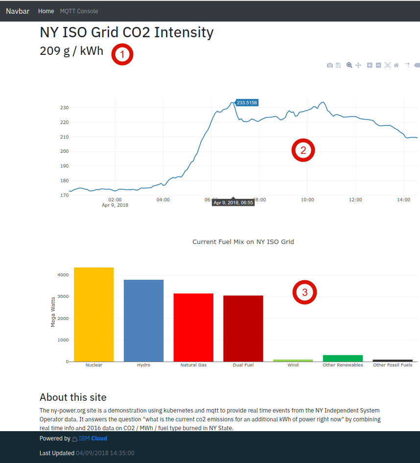

*他の言語で読む: [English](README.md).*

[](https://travis-ci.org/IBM/ny-power)

# MQTT とマイクロサービスを使用して公開データを公開イベント・ストリームに変換する

幸いなことに、多くの団体がデータを公開しています。 ただし、データ形式の違いにより、アプリケーションでこれらをそのまま利用できないこともあります。今回は、ニューヨーク州の電源グリッド独立系統運用者 (ISO) の提供するデータを例にとります。これはグリッドの状態に関するデータを、5分毎の分解能で提供しており、イベント・ストリームとして利用するのに非常に適しています。

いったん生データをイベントストリームに変換すれば、追加の処理を追加できます。例えば、1日の間に生成され排出された CO<sub>2</sub> 量を推定するなど。これらすべては Kubernetes 上の一連のマイクロサービスとして行われ、それぞれが問題の特定の部分監視します。これによりデバッグや新機能の追加が非常に容易になります。

## 課題をより理解する

私たちは最近、Chevy Bolt EV を購入し、自家用車として使用しています。私たちは自宅でレベル2チャージャーで充電します。いつ車を充電するのが望ましいでしょうか？

私たちのエリアで使用されている使用時間は、過去の統計からみると、平日の午後2時から午後7時にピークに達しています。電力会社としてはなるべく利用を控えてほしい時間帯ですが、グリッドは需要に合わせて日々変化しています。ニューヨーク州独立系統運用者 ([NYISO](http://www.nyiso.com/public/index.jsp)) は、ニューヨーク州の電力網の管理を担当しています。彼らは、ニューヨーク州で発電用に使用されている燃料源についてのほぼリアルタイムのデータを提供しています。


電力に関するデータは公開されていますが、公開APIはありません。NY ISO は、http://mis.nyiso.com/public/ サーバー上に5分毎の分解能のCSVファイルを公開しています。これらは5〜20分ごとに更新されます。

すべてのアプリケーションで CSV ファイルを直接解析するのではなく、データをリアルタイムのストリームに変換することでよりうまく処理できます。
これは、マイクロサービスで CSV をポーリングして解析し、新しいイベントをパブリック [MQTT](http://mqtt.org/) サービスに送信することで実現できます。
パブリックなMQTTサービスを利用するためのオーバーヘッドは非常に低く、オープンソケットだけあれば利用できます。
このデータ変換を実施した後、1日の間に発電された電力のkWhあたりに排出される推定 CO<sub>2</sub> 量を計算するなど、その値に付加価値をつける分析を行うこともできます。
この付加価値データは MQTT バスにも公開され、直接利用することができます。

websocket を介して MQTT サービスに直接接続する Web ページは、サーバー・ポーリングを行わない動的 Web サイトをどのように提供し、関連データが提供されたときにどのように更新するか、を理解するための良いサンプルです。

アプリケーション全体は Helm を使用して Kubernetes にデプロイ配備されます。これにより、ごく少ない手順でアプリケーションの新しいコピーを作成し、実動バージョンの実行中にアプリケーションの開発バージョンで作業することが可能になります。

このコードパターンを完了すると、以下のことを理解できます:

* MQTT サーバーを使用してリアルタイム・イベント・ストリームを提供する
* Web ブラウザから MQTT ストリームを直接利用する
* Helm を使用して Kubernetes アプリケーションをデプロイする

## Flow


1. ユーザーが Web サイトを開きます
2. Web ブラウザーは MQTT サービスに直接アクセスします
3. アプリケーションのデータポンプが毎分、外部の CSV ファイルをポーリングして新しいデータを入手します
4. データが MQTT サービスにプッシュされます
5. アーカイバーは MQTT サービスをサブスクライブしており、すべての新しいデータを Influx DB に送信します
6. 新しいデータで、現在の CO<sub>2</sub> / kWh を計算し、それを最新の時系列とともに MQTT サービスにパブリッシュします

## 含まれるコンポーネント

* IBM Cloud Container Service

## 利用した技術

* [Kubernetes](https://kubernetes.io/): クラスタ化したコンテナの運用ツール
* [Helm](https://docs.helm.sh/): Kubernetes 用のパッケージ管理ツール
* [MQTT](http://mqtt.org/): 軽量のパブリッシュ/サブスクライブ用プロトコル
* [Mosquitto](https://mosquitto.org/): オープンソースの MQTT broker
* [Influxdb](https://www.influxdata.com/): 時系列データベース
* [Python](https://www.python.org/): すべてのロジックに使用される主なプログラミング言語

# 前提条件

まずは、以下の準備が必要です:

1. Pay-Go レベルのアクセス権を持つ [IBM Cloud Account](https://www.ibm.com/cloud/container-service/resources) - *kubernetes クラスターは有料アカウントを必要とし、更にこのパターンではフリーティアでは利用できない Ingress Controllers と Load Balancer を利用します*
2. [IBM developer  tools](https://github.com/IBM-Cloud/ibm-cloud-developer-tools#idt-macos--linux-installation) をインストールします。
3. [Helm](https://docs.helm.sh/using_helm/#installing-helm) をインストールします。
4. イメージを簡単に作成できるよう、あなたのプラットフォーム用の ``make`` をインストールします。

# 手順

## 1. Kubernetes クラスターを作成する

[IBM Cloud Web Console](https://console.bluemix.net/containers-kubernetes/catalog/cluster/create) で Kubernetes クラスターを作成します。
このパターンは、単一の可用性ゾーンに、単一のノードクラスタを持つ最小のノードタイプ(2x4)で動作します。
どの地域 (region) にも設置できます。

**ノート:** kubernetes クラスタがスピンアップ (開始) するのに約20分かかります。それが完了してから次のステップに進んでください。

## 2. IBM ツールと Helm を準備する

Kubernetes クラスタが準備完了したら、すべてのツールをローカルに設定します。

```
# Log into IBM cloud
$ ibmcloud login

# List active clusters
$ ibmcloud cs clusters
```

あなたのクラスタが `normal` で問題なく動作していると分かったら、次へ進みます。

```
# Setup kubectl for your cluster
$ $(ibmcloud cs cluster-config <clustername> | grep export)

# Initialize helm
$ helm init
```

## 3. コンテナ・レジストリを構成する

ny-power アプリケーションは、多数のカスタムイメージをアップロードする必要があります。アップロード先となるカスタムコンテナのレジストリを作成する必要があります。

```
$ ibmcloud cr namespace-add ny-power
```

## 4. 必要なイメージを作成する

アプリケーションを実行するには5つのイメージが必要です。
これを単純化するために、5つのイメージのバージョンを生成するため、そして表示するため、makefile ターゲットが2つ設定されています。
ビルドイメージが呼び出されるたび、イメージのバージョン番号が増加し、ローリングアップグレードが可能になります。

```
# generate all images
$ make build-images
```

イメージのバージョンは以下で表示できます:

```
$ make image-versions
```

**ノート:** イメージの作成には約2分かかります

## 5. Helm overrides.yaml を作成する

`ny-power/values.yaml` に `ny-power` アプリケーション用のバージョン管理された設定があります あなたの環境にデプロイするには、インストールに使用する overrides ファイルを作成する必要があります。

```
# copy overrides sample
$ cp overrides.yaml.sample overrides.yaml
```

更新が必要な情報は3種類あります:

最初はイメージのバージョンです。 `make image-versions` は、overrides.yaml で設定できるバージョン番号のリストを返します。

2番目は入力ホストです。

```
# Get the Ingress Subdomain
$ ibmcloud cs cluster-get <clustername>
```

`Ingress Subdomain` フィールドを探します。

3番目は MQTT サービスの共有シークレットです。あなたが望むシークレットを選択してください。

## 6. Helm を使ってインストールします

```
$ heml install ny-power -f overrides.yaml --name nytest
```

これは `nytest` という名前の ny-power アプリケーションをデプロイします。Helm を使用すると、開発、qa、A/Bテストなどの目的で、同じクラスター内で複数のバージョンのアプリケーションを同時に実行できます。

また、override 値を使用することも指定します。これにより、アプリケーションのバージョン管理された構成に影響を与えずに使用する値を変更することができます。

次のようにして、デプロイの状態を確認できます:
```
$ heml status nytest
```

**ノート:** 最初のデプロイには3〜5分かかります。そのほとんどの時間は、MQTT および Ingress ポッド用の永続ボリュームの準備に費やされます。

## 7. 変更を試してみる

アプリケーションを変更したり、Helm 構成を変更したり、アプリケーションとイメージを変更したりして、クラスタのライブアップグレードを実行してみましょう。

`overrides.yaml` に更新されたイメージバージョンを設定し、実行します:

```
$ helm upgrade -f overrides.yaml nytest ny-power
```

# サンプル出力

## デプロイメント

デプロイが成功すると、次のような表示になります:

```
$ helm status nytest
LAST DEPLOYED: Tue Jul 10 10:24:04 2018
NAMESPACE: default
STATUS: DEPLOYED

RESOURCES:
==> v1/Secret
NAME                       TYPE    DATA  AGE
nytest-ny-power-mqtt-pump  Opaque  1     3m

==> v1/ServiceAccount
NAME                      SECRETS  AGE
nytest-ny-power-readersa  1        3m

==> v1/RoleBinding
NAME                           AGE
nytest-ny-power-read-services  3m

==> v1/Service
NAME                    TYPE          CLUSTER-IP      EXTERNAL-IP    PORT(S)                      AGE
nytest-ny-power-influx  ClusterIP     172.21.190.64   <none>         8086/TCP                     3m
nytest-ny-power-mqtt    LoadBalancer  172.21.189.72   169.60.78.154  1883:32230/TCP,80:31009/TCP  3m
nytest-ny-power-web     ClusterIP     172.21.180.134  <none>         5000/TCP                     3m

==> v1/PersistentVolumeClaim
NAME                        STATUS  VOLUME                                    CAPACITY  ACCESS MODES  STORAGECLASS      AGE
nytest-ny-power-influx-nfs  Bound   pvc-e5e38aca-844c-11e8-894f-0a833e5777dc  20Gi      RWX           ibmc-file-silver  3m
nytest-ny-power-mqtt-nfs    Bound   pvc-e5e4354c-844c-11e8-894f-0a833e5777dc  20Gi      RWX           ibmc-file-silver  3m

==> v1/Role
NAME                             AGE
nytest-ny-power-services-reader  3m

==> v1/Deployment
NAME                     DESIRED  CURRENT  UP-TO-DATE  AVAILABLE  AGE
nytest-ny-power-archive  1        1        1           1          3m
nytest-ny-power-pump     1        1        1           1          3m
nytest-ny-power-influx   1        1        1           1          3m
nytest-ny-power-mqtt     1        1        1           1          3m
nytest-ny-power-web      2        2        2           2          3m

==> v1beta1/Ingress
NAME                         HOSTS                                         ADDRESS        PORTS  AGE
nytest-ny-power-www-ingress  sdague-k001.us-east.containers.mybluemix.net  169.60.78.158  80     3m

==> v1/Pod(related)
NAME                                      READY  STATUS   RESTARTS  AGE
nytest-ny-power-archive-6449595859-4kf98  1/1    Running  0         3m
nytest-ny-power-pump-6bffd5ffb5-j7lm5     1/1    Running  1         3m
nytest-ny-power-influx-66f4789cd8-rqw8z   1/1    Running  0         3m
nytest-ny-power-mqtt-569ddb657d-mblr9     1/1    Running  0         3m
nytest-ny-power-web-56c54b69c5-sb56s      1/1    Running  0         3m
nytest-ny-power-web-56c54b69c5-snbmd      1/1    Running  0         3m

```

`Ingress Subdomain` (この例では: http://sdague-k001.us-east.containers.mybluemix.net) をブラウズし、実行中のアプリケーションを見ることができます。

## アプリケーション

アプリケーションのデプロイが成功すると、アプリケーションは以下のように表示されます:



This visualizes a number of things:
これは多くのことを視覚化しています:

1. NY ISO グリッドの現在の CO<sub>2</sub> 排出量レベル
2. トレンドを可視化するため、過去20時間のCO<sub>2</sub> 排出量レベルの履歴
3. ニューヨークのISOグリッドにおける燃料の現在の混合

これらのすべては、MQTT バスに新しい情報が公開されるたびに更新され、ユーザーの操作やポーリングは不要です。

# リンク

# もっと学ぶ

* **Container Orchestration コードパターン**: このコードパターンを気に入りましたか？ [Container Orchestration Code Patterns](https://developer.ibm.com/jp/technologies/container-orchestration/) から関連パターンを参照してください。
* **Kubernetes on IBM Cloud**: [Kubernetes and Docker on IBM Cloud](https://www.ibm.com/cloud-computing/bluemix/containers) の力を合わせてアプリを配信する。

# ライセンス
[Apache 2.0](LICENSE)
