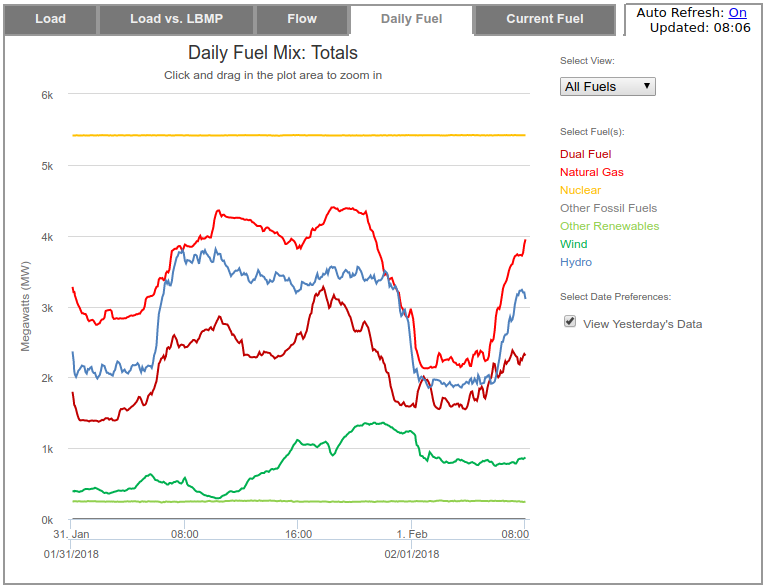
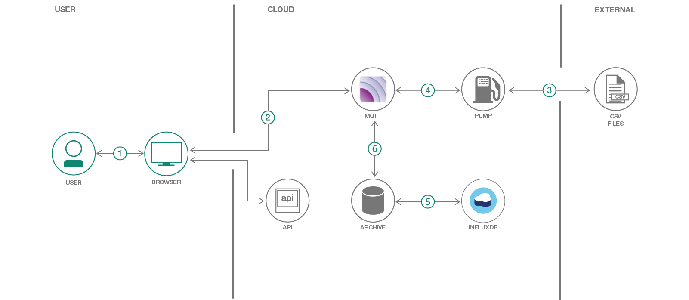

*다른 언어로 보기: [English](README.md), [日本語](README-ja.md).*

[](https://travis-ci.org/IBM/ny-power)

# MQTT와 마이크로 서비스로 공공 데이터를 공공 이벤트 스트림으로 변환하기 #

운좋게도 많은 기관들이 그들의 데이터를 공개하고 있습니다. 그러나, 이런 데이터가 애플이케이션이 사용하는데 항상 적합한 형식으로 제공되는 것은 아닙니다. 뉴욕 전력망의 NY ISO 데이터를 예로 들 수 있습니다. 전력망의 상태에 대한 5분간의 데이터는 이벤트 스트림으로 제공하는 것이 가장 좋습니다.

원시 데이터를 이벤트 스트림으로 변환하면 추가적인 절차를 추가 할 수 있습니다. 예를 들면, 하루 동안 발생하는 CO<sub>2</sub> 배출량 추정하기 등이 있습니다. 이에 대한 모든 작업은 Kubernetes에서 일련의 마이크로 서비스로 수행되며, 서비스들은 문제의 특정 부분들을 각각 처리합니다. 이렇게 하면 디버그와 새로운 기능 추가와 같은 부분을 훨씬 쉽게 할 수 있습니다.

## 깊이 있게 들여다 보기

최근 우리는 Chevy Bolt EV 차량을 구입해 주로 사용하고 있습니다. 집에서는 레벨2 충전기로 충전합니다. 그러면, 우리는 차를 언제 충전해야 할까요?

우리 지역의 정적 시간대 사용 요금제(Time-Of-Use Billing)은 주중 오후 2시에서 오후 7시까지를 피크(Peak)로 기록합니다. 그 시간이 전력 공급사가 여러분이 충전하지 않기를 바라는 유일한 때 뿐이긴 하지만, 전력 시스템은 하루동안 수요를 맞추기 위해서 다양하게 변화합니다.

 New York State Independent System Operator([NYISO](http://www.nyiso.com/public/index.jsp))는 뉴욕 주의 전력망을 관리합니다. 이들은 뉴욕 주에서 전기 생산에 사용되는 연료원에 대해 실시간에 가까운 데이터를 제공합니다.



이 발전에 대한 데이터는 공공용으로 제공하지만, 공공 API는 아닙니다. NY ISO는 http://mis.nyiso.com/public/ 에서 5분간 데이터를 CSV 파일로 발행합니다. 이 데이터는 매 5분에서 20분 마다 업데이트됩니다.

모든 애플리케이션이 CSV 파일을 직접 파싱하는 것 보다는 데이터를 실시간 스트리밍으로 만드는 것이 더 좋습니다. 이를 위해 마이크로 서비스에서 CSV를 폴링 및 파싱하고 공공 [MQTT](http://mqtt.org/) 서비스로 새로운 이벤트를 생성합니다. 공공 MQTT 서비스에서 데이터를 받는 것은 부하가 적으며, 소켓 하나 정도만 열려 있으면 됩니다. 이 데이터를 처리하여 하루 동안의 생성된 전력량 kWh 대비 발생한 대략적인 CO<sub>2</sub> 추정치 계산과 같은 데이터 분석을 "추가 가치"로 제공할 수 있습니다. 이와 같은 가치 추가된 데이터도 역시 MQTT 버스로 발행되며 직접적인 사용도 가능합니다.

MQTT 서버에 websocket으로 직접 연결하는 웹 페이지에서는 서버 폴링없이, 관련 데이터가 제공되는 경우만 업데이트되는 동적 웹사이트를 어떻게 만들 수 있는지 보여줍니다.

전체 애플리케이션은 Helm을 이용하여 Kubernetes에 배포됩니다. 이는 사용자가 아주 약간의 단계만으로 애플리케이션의 새로운 복제본을 가져와 운영 버젼이 실행 중에도 개발 버젼으로 작업하는 것이 가능하게 합니다.

여러분이 이 코드 패턴을 완료하게 되면 다음과 같은 부분을 이해하게 됩니다:

* 실시간 이벤트 스트림을 제공하기 위한 MQTT 서버를 사용하기
* 웹 브라우저에서 직접 MQTT 스트림 받기
* Helm으로 애플리케이션을 Kubernetes에 배포하기

## 순서



1. 사용자가 웹사이트에 접근합니다
2. 웹 브라우저가 MQTT 서비스에 직접 접근합니다
3. 새로운 데이터 확인을 위해 매 분마다 애플리케이션 데이터 펌프가 NY ISO를 조회합니다.
4. 데이터가 MQTT 서비스로 푸시됩니다
5. 아카이버가 MQTT 서비스를 구독하고 모든 신규 데이터를 Influx DB로 전송합니다
6. 신규 데이터로 현재 CO<sub>2</sub> / kWh를 계산하고 그 결과와 최근 시계열 데이터를 MQTT 서비스로 발행합니다

## 포함된 구성요소

* IBM Cloud Container 서비스

## 주요 기술

* [Kubernetes](https://kubernetes.io/): 컨테이너 운영 도구
* [Helm](https://docs.helm.sh/): Kubernetes용 애플리케이션 패키지 및 배포 도구
* [MQTT](http://mqtt.org/): 경량화된 발행/구독 프로토콜
* [Mosquitto](https://mosquitto.org/): 오픈 소스 MQTT broker
* [Influxdb](https://www.influxdata.com/): 시계열 데이터베이스
* [Python](https://www.python.org/): 전체 논리에 사용된 주요 프로그래밍 언어


# 전제 조건

시작 전에 다음 부분에 대한 준비가 필요합니다:

1. Pay-Go 수준의 권한을 가진 
   [IBM Cloud 계정](https://www.ibm.com/cloud/container-service/resources) - *kubernetes 클러스터가 유료 계정이 필요하며,
   이 코드 패턴에서는 무료 티어에서는 사용 할 수 없는 Ingress Controller와 Load Balancer를 사용합니다.*
2. [IBM 개발자 도구](https://github.com/IBM-Cloud/ibm-cloud-developer-tools#idt-macos--linux-installation) 설치
3. [Helm](https://docs.helm.sh/using_helm/#installing-helm) 설치
4. 이미지 빌드를 쉽게 할 수 있도록 플랫폼에 ``make`` 설치.

# 단계

## 1. Kubernetes 클러스터 생성하기

[IBM Cloud 웹 콘솔](https://console.bluemix.net/containers-kubernetes/catalog/cluster/create)에서 Kubernetes 클러스터를 생성합니다.
이 패턴은 단일 노드 클러스터, 단일 가용존에서 동작하는 가장 작은 노드 타입(2x4)에서 동작합니다. 어떤 지역(region)에도 설치 가능합니다.

**참고:** Kubernetes 클러스터 생성에 대략 20분 정도 소요됩니다. 다음 단계를 진행하기 전에 완료되어야 합니다.

## 2. IBM Tools과 Helm 설정하기

Kubernetes 클러스터가 준비되었다면, 모든 도구를 로컬에서 설정합니다.

```
# IBM cloud에 로그인 합니다
$ ibmcloud login

# 클러스터를 나열합니다
$ ibmcloud cs clusters
```

클러스터를 `정상`적으로 볼 수 있다면 진행할 수 있습니다.

```
# 클러스터에 대해 kubectl을 설정합니다
$ $(ibmcloud cs cluster-config <clustername> | grep export)

# helm을 초기화 합니다
$ helm init
```

## 3. 컨테이너 레지스트리 설정하기

ny-power 애플리케이션은 여러 개의 사용자 정의 이미지를 업로드해야 합니다. 이에 업로드를 할 사용자 정의 컨테이너 레지스트리를 만들 필요가 있습니다.

```
$ ibmcloud cr namespace-add ny-power
```

## 4. 필요한 이미지 빌드하기

애플리케이션 실행에는 5개의 이미지가 필요합니다. 이를 단순하게 하기 위해 5개의 이미지를 생성하고 버젼을 표시하는 2개의 makefile이 있습니다. 빌드 이미지가 호출될 때 이미지에 대한 버젼 숫자가 증가되어 rolling 업데이트가 가능하게 됩니다.

```
# 모든 이미지 생성하기
$ make build-images
```

이미지 버전들은 아래와 같이 표시될 수 있습니다

```
$ make image-versions
```

**참고:** 이미지 빌드에는 대략 2분 정도 소요됩니다

## 5. Helm overrides.yaml 작성하기

`ny-power` 애플리케이션에 대한 버젼 구성은 `ny-power/values.yaml`에 있습니다. 여러분의 환경에 배포하려면 여러분 설치에 특정한 override 파일을 생성해야 합니다.

```
# overrides 예제 복사하기
$ cp overrides.yaml.sample overrides.yaml
```

반드시 업데이트되어야 하는 3가지 정보가 있습니다:

첫 번째는 이미지의 버젼입니다. `make image-versions`이 overrides.yaml에 설정할 수 있는 버젼 수를 나열합니다.

두 번째는 ingress 호스트입니다.

```
# Ingress Subdomain을 확인합니다
$ ibmcloud cs cluster-get <clustername>
```

`Ingress Subdomain` 필드를 확인합니다.

세 번째는 MQTT 서비스에 대한 비밀번호입니다. 여러분이 필요로 하는 임의의 비밀번호를 선택합니다.

## 6. Helm으로 설치하기

```
$ helm install ny-power -f overrides.yaml --name nytest
```

이 배포에서는 ny-power 앱을 `nytest` 라는 이름으로 진행합니다. Helm은 개발, 검증 혹은 A/B 테스트 목적으로 하나 이상의 버젼의 애플리케이션을 동일한 클러스터에 동시에 실행되도록 할 수 있습니다.

또한, override 값을 사용하도록 지정 할 수도 있습니다. 이는 애플리케이션에 이미 설정된 버젼 정보에 영향 없이 변경할 수 있게 합니다.

다음 명령으로 배포 상태를 볼 수 있습니다:

```
$ helm status nytest
```

**참고:** 초기 배포는 3 - 5 분이 소요됩니다. MQTT와 Ingress 팟을 위한 persistent volumes 구성에 대부분의 시간이 사용됩니다.

## 7. 변경 및 실험 해보기

helm 설정이나 애플리케이션 이미지를 변경하여 클러스터의 라이브 업그레이드를 진행 할 수 있습니다.

여러분의 `overrides.yaml`에 있는 이미지 버젼을 업데이트 하고 다음과 같이 실행합니다:

```
$ helm upgrade -f overrides.yaml nytest ny-power
```

# 예제 결과

## 배포

배포가 성공하면 아래와 같이 보여집니다:

```
$ helm status nytest
LAST DEPLOYED: Tue Jul 10 10:24:04 2018
NAMESPACE: default
STATUS: DEPLOYED

RESOURCES:
==> v1/Secret
NAME                       TYPE    DATA  AGE
nytest-ny-power-mqtt-pump  Opaque  1     3m

==> v1/ServiceAccount
NAME                      SECRETS  AGE
nytest-ny-power-readersa  1        3m

==> v1/RoleBinding
NAME                           AGE
nytest-ny-power-read-services  3m

==> v1/Service
NAME                    TYPE          CLUSTER-IP      EXTERNAL-IP    PORT(S)                      AGE
nytest-ny-power-influx  ClusterIP     172.21.190.64   <none>         8086/TCP                     3m
nytest-ny-power-mqtt    LoadBalancer  172.21.189.72   169.60.78.154  1883:32230/TCP,80:31009/TCP  3m
nytest-ny-power-web     ClusterIP     172.21.180.134  <none>         5000/TCP                     3m

==> v1/PersistentVolumeClaim
NAME                        STATUS  VOLUME                                    CAPACITY  ACCESS MODES  STORAGECLASS      AGE
nytest-ny-power-influx-nfs  Bound   pvc-e5e38aca-844c-11e8-894f-0a833e5777dc  20Gi      RWX           ibmc-file-silver  3m
nytest-ny-power-mqtt-nfs    Bound   pvc-e5e4354c-844c-11e8-894f-0a833e5777dc  20Gi      RWX           ibmc-file-silver  3m

==> v1/Role
NAME                             AGE
nytest-ny-power-services-reader  3m

==> v1/Deployment
NAME                     DESIRED  CURRENT  UP-TO-DATE  AVAILABLE  AGE
nytest-ny-power-archive  1        1        1           1          3m
nytest-ny-power-pump     1        1        1           1          3m
nytest-ny-power-influx   1        1        1           1          3m
nytest-ny-power-mqtt     1        1        1           1          3m
nytest-ny-power-web      2        2        2           2          3m

==> v1beta1/Ingress
NAME                         HOSTS                                         ADDRESS        PORTS  AGE
nytest-ny-power-www-ingress  sdague-k001.us-east.containers.mybluemix.net  169.60.78.158  80     3m

==> v1/Pod(related)
NAME                                      READY  STATUS   RESTARTS  AGE
nytest-ny-power-archive-6449595859-4kf98  1/1    Running  0         3m
nytest-ny-power-pump-6bffd5ffb5-j7lm5     1/1    Running  1         3m
nytest-ny-power-influx-66f4789cd8-rqw8z   1/1    Running  0         3m
nytest-ny-power-mqtt-569ddb657d-mblr9     1/1    Running  0         3m
nytest-ny-power-web-56c54b69c5-sb56s      1/1    Running  0         3m
nytest-ny-power-web-56c54b69c5-snbmd      1/1    Running  0         3m

```

여러분의 `Ingress Subdomain` (이 예제의 경우: http://sdague-k001.us-east.containers.mybluemix.net) 를 탐색하여 실행되는 애플리케이션을 확인 할 수 있습니다.

## 애플리케이션

애플리케이션의 배포가 성공하면 아래와 같이 보여집니다:


이는 다음과 같은 여러가지를 시각화 합니다:

1. NY ISO망의 현재 탄소 집약도
2. 추세에 대한 시각화를 위해 최근 20시간에 걸치 탄소 집약도의 기록
3. NY ISO망이 현재 사용중인 연료의 혼합량

이러한 모든 정보는 MQTT 버스에 새로운 정보가 공개 될 때마다 사용자의 조작이나 폴링없이 업데이트됩니다.

# 링크

# 자세히 보기

Container Orchestration 코드 패턴:: 이 코드 패턴을 즐기셨나요? 다른 Container Orchestration 코드 패턴도 확인해 보세요
* **Container Orchestration 코드 패턴**: 이 코드 패턴을 즐기셨나요? 다른 [Container Orchestration 코드 패턴](https://developer.ibm.com/code/technologies/container-orchestration/)도 확인해 보세요.
* **IBM Cloud Kubernetes**: [IBM Cloud에서 Kubernetes와 Docker](https://www.ibm.com/cloud-computing/bluemix/containers)의 기능으로 애플리케이션을 개발해 보세요

# 라이센스
[Apache 2.0](LICENSE)
