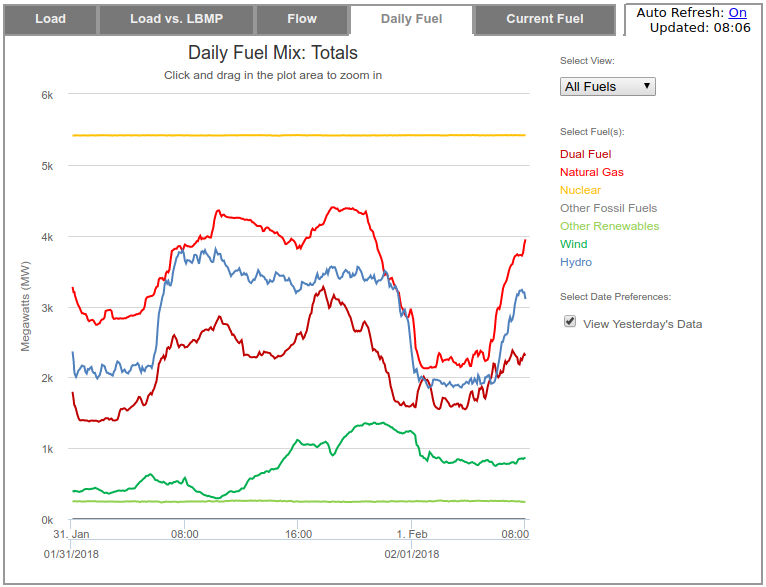

[](https://travis-ci.org/IBM/ny-power)

# Turning Open Data into an Open Event Stream with MQTT and microservices #

We're fortunate that more institutions are publishing their data in
the open. However, those formats aren't always the most accessible for
consuming that data in applications. Take for instance the NY ISO data
on the NY power grid. This 5 minute resolution data on the state of
the grid is best served as an event stream.

Once we have converted the raw data into an event stream we can add
additional processing. For instance, estimating the CO<sub>2</sub>
emissions generated over the course of the day. All of this is done as
a series of microservices on Kubernetes, each tackling one specific
part of the problem. This makes debug and adding new features much
easier.

## The Problem in Depth

We recently bought a Chevy Bolt EV, which we use as our primary
vehicle. We charge at home with a Level 2 charger. When should we
charge the car?

Static time of use billing in our area marks peak at 2pm - 7pm
weekdays. While that's the only time the power company doesn't want
you to charge, the grid varies a lot over the course of the day to
match demand. The New York State Independent System Operator
([NYISO](http://www.nyiso.com/public/index.jsp)) is responsible for
managing the power grid in NY State. They provide near real time data
about what fuel sources are being used to generate electricity in NY
State.



While the data that powers this is public, there is no public API. The
NY ISO does publish a set of 5 minute resolution CSV files on their
servers at http://mis.nyiso.com/public/. These are updated every 5 to
20 minutes.

Instead of having every application parse CSV files directly, we can
do better by making the data into a real time stream. This is done by
polling and parsing the CSV in a micro service and publishing new
events to a public [MQTT](http://mqtt.org/) service. The overhead for
consuming a public MQTT service is very low, and requires just an open
socket. After injesting this data we can also provide "value add"
analysis of it, such as computing the estimated CO<sub>2</sub> emitted
per kWh of electricity generated over the course of the day. This
added value data is also published on the MQTT bus and can be consumed
directly.

A web page which connects directly to the MQTT service over a
websocket shows how you can provide a dynamic web site with no server
polling, only updating when relevant data is provided.

The entire application is deployed in Kubernetes using Helm. This
makes it possible to bring up new copies of the application with very
few user steps, and work on a development version of the application
while a production version is running.

When the user has completed this Code Pattern they will understand how
to:

* Use an MQTT server to provide real time event stream
* Consume an MQTT stream directly from a web browser
* Deploy an application on Kubernetes with Helm

## Flow


1. The user accesses the website
2. The web browser directly accesses the MQTT service
3. The applications data pump polls NY ISO every minute looking for
   new data.
4. Data is pushed to MQTT service
5. The archiver is subscribed to the MQTT service sends all new data
   to Influx DB
6. On any new data it computes current CO<sub>2</sub> / kWh, and
   publishes both it, and the recent time series to the MQTT service.

## Included components

* IBM Cloud Container Service

## Featured technologies

* [Kubernetes](https://kubernetes.io/): container orchestration
* [Helm](https://docs.helm.sh/): application packaging and deployment
  for Kubernetes
* [MQTT](http://mqtt.org/): light weight publish / subscribe protocol
* [Mosquitto](https://mosquitto.org/): open source MQTT broker
* [Influxdb](https://www.influxdata.com/): time series database
* [Python](https://www.python.org/): main programming language used for all logic

# Prerequisites

Before proceeding you'll need to following:

1. An
   [IBM Cloud Account](https://www.ibm.com/cloud/container-service/resources) with
   Pay-Go level access - *kubernetes clusters require a paid account,
   and the pattern uses Ingress Controllers and Load Balancer which
   aren't available at the free tier*
2. Install [IBM developer
   tools](https://github.com/IBM-Cloud/ibm-cloud-developer-tools#idt-macos--linux-installation)
3. Install [Helm](https://docs.helm.sh/using_helm/#installing-helm)
4. Install ``make`` on your platform to make it easy to build images.

# Steps

## 1. Create you Kubernetes cluster

Create a Kubernetes cluster in
the
[IBM Cloud Web Console](https://console.bluemix.net/containers-kubernetes/catalog/cluster/create).
This pattern will work on the smallest node type (2x4), with a single
node cluster, in a single availability zone. It can be installed in
any region.

**Note:** it takes approximately 20 minutes for a kubernetes cluster
to spin up. That needs to be done before the next step will work.

## 2. Setup IBM Tools and Helm

After the Kubernetes cluster is ready, it is time to configure all the
tools locally.

```
# Log into IBM cloud
$ ibmcloud login

# List active clusters
$ ibmcloud cs clusters
```

If you see your cluster as `normal` you can proceed.

```
# Setup kubectl for your cluster
$ $(ibmcloud cs cluster-config <clustername> | grep export)

# Initialize helm
$ helm init
```

## 3. Configure Container Registry

The ny-power application needs to upload a number of custom
images. You need to create a custom container registry to upload into.

```
$ ibmcloud cr namespace-add ny-power
```

## 4. Build required images

5 images are needed for the application to run. In order to simplify
this there are 2 makefile targets that exist to generate and display
versions of the 5 images. When build images is called the version
number for the image is incremented every time to allow for rolling
upgrades.

```
# generate all images
$ make build-images
```

The image versions can be displayed with

```
$ make image-versions
```

**Note:** Image building takes approximately 2 minutes

## 5. Create Helm overrides.yaml

There is a versioned configuration for the `ny-power` application at
`ny-power/values.yaml`. To deploy in your environment you'll need to
create an overrides file that's specific to your install.

```
# copy overrides sample
$ cp overrides.yaml.sample overrides.yaml
```

There are 3 types of information that must be updated:

The first is the image versions. `make image-versions` will return a
list of version numbers that can be set in the overrides.yaml.

The second is the ingress host.

```
# Get the Ingress Subdomain
$ ibmcloud cs cluster-get <clustername>
```

Look for the `Ingress Subdomain` field.

The third is the shared secret for the MQTT service. Choose any secret
you want.

## 6. Install with Helm

```
$ heml install ny-power -f overrides.yaml --name nytest
```

This will deploy the ny-power app with the name `nytest`. Helm allows
you to have more than one version of an application running at the
same time in the same cluster for developent, qa, or A/B testing
purposes.

It also specifies to use your override values. This allows you to
change those without impacting versioned configuration for the
application.

You can see the status of deployment with:

```
$ heml status nytest
```

**Note:** Initial Deployment takes 3 - 5 minutes. Most of the time is
spent provisioning persistent volumes for MQTT and Ingress pods.

## 7. Make changes and experiment

As you make changes to the application, either in the helm
configuration, or make changes to the applications and images, you can
do a live upgrade of the cluster.

Set any updated image versions in your `overrides.yaml` and run:

```
$ helm upgrade -f overrides.yaml nytest ny-power
```

# Sample output

## Deployment

A successful deployment looks like the following:

```
$ helm status nytest
LAST DEPLOYED: Tue Jul 10 10:24:04 2018
NAMESPACE: default
STATUS: DEPLOYED

RESOURCES:
==> v1/Secret
NAME                       TYPE    DATA  AGE
nytest-ny-power-mqtt-pump  Opaque  1     3m

==> v1/ServiceAccount
NAME                      SECRETS  AGE
nytest-ny-power-readersa  1        3m

==> v1/RoleBinding
NAME                           AGE
nytest-ny-power-read-services  3m

==> v1/Service
NAME                    TYPE          CLUSTER-IP      EXTERNAL-IP    PORT(S)                      AGE
nytest-ny-power-influx  ClusterIP     172.21.190.64   <none>         8086/TCP                     3m
nytest-ny-power-mqtt    LoadBalancer  172.21.189.72   169.60.78.154  1883:32230/TCP,80:31009/TCP  3m
nytest-ny-power-web     ClusterIP     172.21.180.134  <none>         5000/TCP                     3m

==> v1/PersistentVolumeClaim
NAME                        STATUS  VOLUME                                    CAPACITY  ACCESS MODES  STORAGECLASS      AGE
nytest-ny-power-influx-nfs  Bound   pvc-e5e38aca-844c-11e8-894f-0a833e5777dc  20Gi      RWX           ibmc-file-silver  3m
nytest-ny-power-mqtt-nfs    Bound   pvc-e5e4354c-844c-11e8-894f-0a833e5777dc  20Gi      RWX           ibmc-file-silver  3m

==> v1/Role
NAME                             AGE
nytest-ny-power-services-reader  3m

==> v1/Deployment
NAME                     DESIRED  CURRENT  UP-TO-DATE  AVAILABLE  AGE
nytest-ny-power-archive  1        1        1           1          3m
nytest-ny-power-pump     1        1        1           1          3m
nytest-ny-power-influx   1        1        1           1          3m
nytest-ny-power-mqtt     1        1        1           1          3m
nytest-ny-power-web      2        2        2           2          3m

==> v1beta1/Ingress
NAME                         HOSTS                                         ADDRESS        PORTS  AGE
nytest-ny-power-www-ingress  sdague-k001.us-east.containers.mybluemix.net  169.60.78.158  80     3m

==> v1/Pod(related)
NAME                                      READY  STATUS   RESTARTS  AGE
nytest-ny-power-archive-6449595859-4kf98  1/1    Running  0         3m
nytest-ny-power-pump-6bffd5ffb5-j7lm5     1/1    Running  1         3m
nytest-ny-power-influx-66f4789cd8-rqw8z   1/1    Running  0         3m
nytest-ny-power-mqtt-569ddb657d-mblr9     1/1    Running  0         3m
nytest-ny-power-web-56c54b69c5-sb56s      1/1    Running  0         3m
nytest-ny-power-web-56c54b69c5-snbmd      1/1    Running  0         3m

```

You will be able to browse to your `Ingress Subdomain` (in this
example: http://sdague-k001.us-east.containers.mybluemix.net) and see
the application running.

## Application

A successful deployment of the application will look as follows:


This visualizes a number of things:

1. The current carbon intensity of the NY ISO grid
2. A historical view of carbon intensity over the last 20 hours to
   visualize trends
3. The current mix of fuels in the NY ISO grid

All of these will be updated everytime there is new information
published on the MQTT bus with no user interaction or polling needed.

# Links

# Learn more

* **Container Orchestration Code Patterns**: Enjoyed this Code Pattern? Check out our other [Container Orchestration Code Patterns](https://developer.ibm.com/code/technologies/container-orchestration/).
* **Kubernetes on IBM Cloud**: Deliver your apps with the combined power of [Kubernetes and Docker on IBM Cloud](https://www.ibm.com/cloud-computing/bluemix/containers)

# License
[Apache 2.0](LICENSE)
