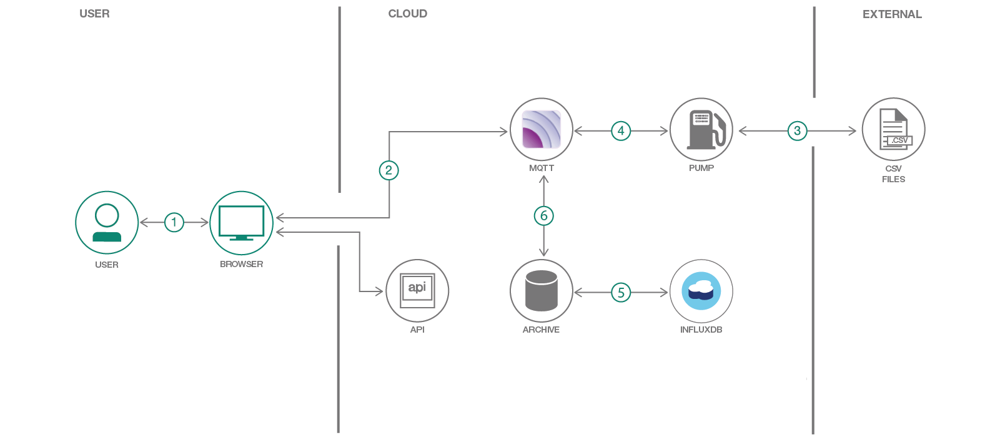

# Making public data available as an event stream #

We recently bought a Chevy Bolt EV, which we use as our primary
vehicle. We charge at home with a Level 2 charger. When should we
charge the car?

Static time of use billing in our area marks peak at 2pm - 7pm
weekdays. While that's the only time the power company doesn't want
you to charge, the grid varies a lot over the course of the day to
match demand. The New York State Indepdendent System Operator (NYISO)
is responsible for managing the power grid in NY State. They provide
near real time data about what fuels are being consumed in NY State to
provide residents electricity.


The data that powers this website is public, but there is no public
API. There are instead a set of 5 minute resolution CSV files
published every 5 - 20 minutes at http://mis.nyiso.com/public/. This
is turned into a public MQTT service which create a very low resource
way of consuming this data. After injesting this data it also
publishes an estimated value of the CO2 per kWh over the course of the
day.

A web page which connects directly to the MQTT service over a
websocket shows how you can provide a dyanmic web site with no server
polling, only updating when relevant data is provided.

The entire application is deployed in Kubernetes using Helm. This
makes it possible to bring up new copies of the application with very
few user steps, and work on a development version of the application
while a production version is running.

When the user has completed this Code Pattern they will understand how
to:

* Use an MQTT server to provide real time event stream
* Consume an MQTT stream directly from a web browser
* Deploy an application on Kubernetes with Helm

## Flow



1. The user accesses the website
2. The webrowser directly accesses the MQTT service
3. The applications data pump polls NY ISO every minute looking for
   new data.
4. Data is pushed to MQTT service
5. The archiver is subscribed to the MQTT service sends all new data
   to Influx DB
6. On any new data it computes current co2 / kWh, and publishes both
   it, and the recent time series to the MQTT service.

## Included components

* IBM Cloud Container Service

## Featured technologies

* Kubernetes: container orchestration
* Helm: application packaging and deployment for Kubernetes
* MQTT: light weight publish / subscribe protocol
* Influxdb: time series database
* Python: main programming language used for all logic

# Watch the video

# Steps

## 1. Install and configure Helm

Install Helm. Full instructions are
at [docs.helm.sh](https://docs.helm.sh/using_helm/#installing-helm)

Create a new cluster in IBM Cloud and initialize helm for it:

```
# Create cluster
$ bx cs cluster-create <clustername>

# Set kubectl config for it
$ $(bx cs cluster-config <clusternam> | grep export)

# Initialize helm
$ helm init
```

## 2. Configure Container Registry

The ny-power application needs to upload a number of custom
images. You need to create a custom container registry to upload into.

```
$ bx cr namespace-add ny-power
```

## 3. Build required images

5 images are needed for the application to run. In order to simplify
this there are 2 makefile targets that exist to generate and display
versions of the 5 images. When build images is called the version
number for the image is incremented every time to allow for rolling
upgrades.

```
# generate all images
$ make build-images
```

The image versions can be displayed with

```
$ make image-versions
```

## 4. Update Helm values.yaml

Open up `ny-power/values.yaml` and edit the image versions in the
yaml.

You can optionally change the shared secret under `mqtt.secret` as
well. This is a shared secret needed to provide write access to the
mqtt stream.

## 5. Install with Helm

```
$ heml install ny-power
```

This will autogenerate a unique name such as laughing-frog. Helm
allows you to have more than one version of an application running at
the same time in the same cluster for developent, qa, or A/B testing
purposes.

You can see the status of deployment with:

```
$ heml status <laughing-frog>
```

## 6. Make changes and experiment

As you make changes to the application, either in the helm
configuration, or make changes to the applications and images, you can
do a live upgrade of the cluster.

Set any updated image versions in your `values.yaml` and run:

```
$ helm upgrade <laughing-frog> ny-power
```

# Sample output

# Links

# Learn more

* **Container Orchestration Code Patterns**: Enjoyed this Code Pattern? Check out our other [Container Orchestration Code Patterns](https://developer.ibm.com/code/technologies/container-orchestration/).
* **Kubernetes on IBM Cloud**: Deliver your apps with the combined power of [Kubernetes and Docker on IBM Cloud](https://www.ibm.com/cloud-computing/bluemix/containers)

# License
[Apache 2.0](LICENSE)
